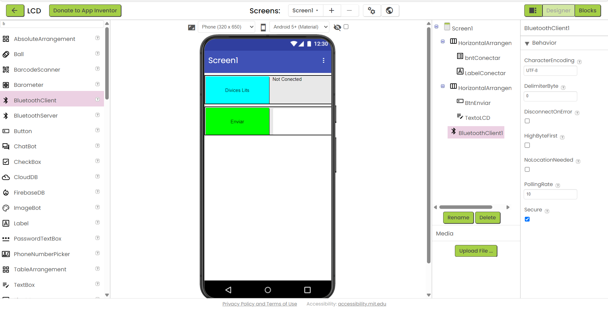
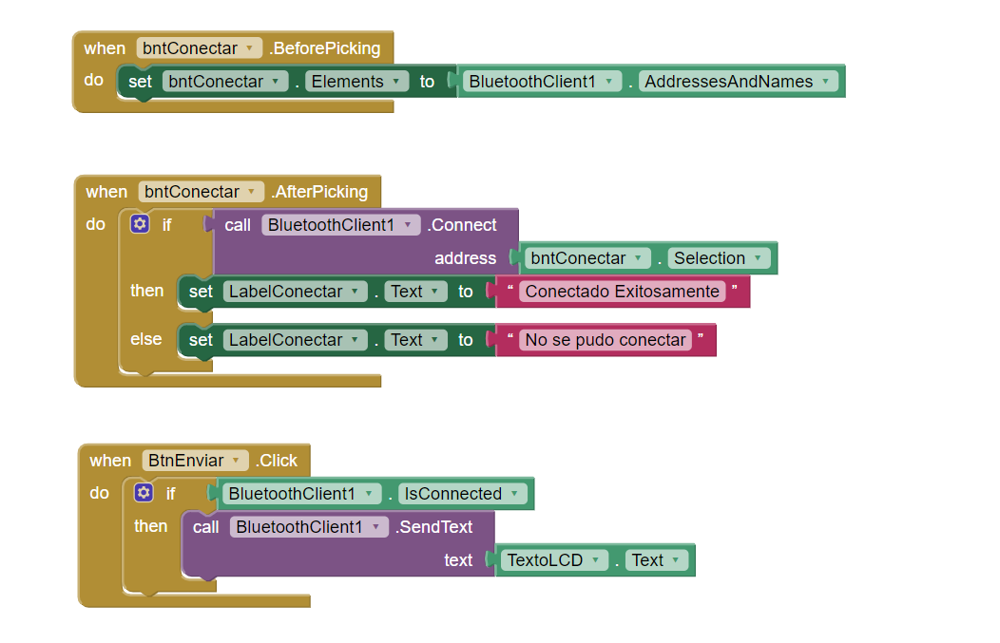
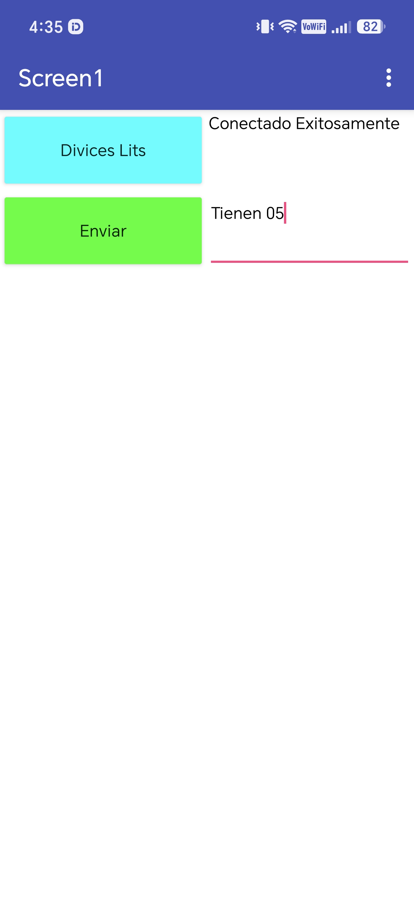
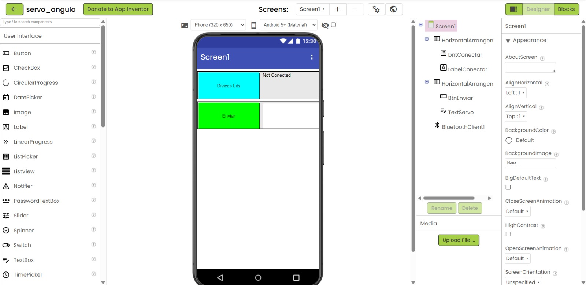
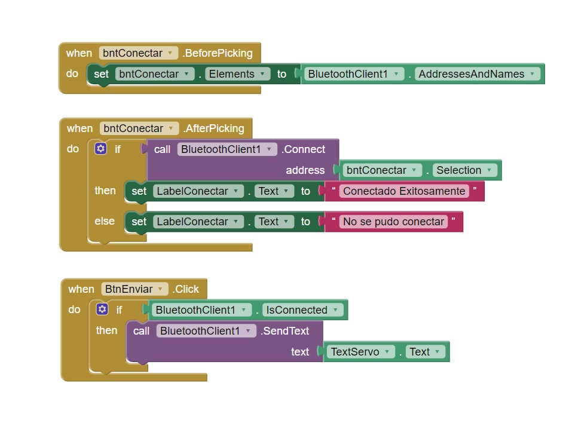
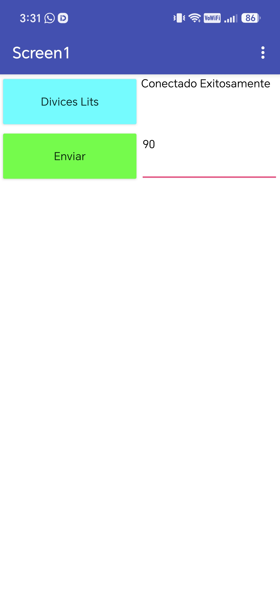

---
# Actividad 1 Ploteo de mensaje en LCD 2x16 a través de Bluetooth y del MIT App Inventor

Objetivo: Diseñar e implementar una aplicación en MIT Inventor y un programa para ESP32, tal que a través de Bluetooth se logre enviar un mensaje desde la APP a un LCD 2x16 conectado a un ESP32
Materiales
- Módulo ESP32 DevKit V1 
- LCD 2x161 
- Cable micro-USB1 Smartphone Android

## Código del ESP32

``` c++

#include <Wire.h>
#include <LiquidCrystal_I2C.h>
#include <BluetoothSerial.h>

BluetoothSerial BT;

LiquidCrystal_I2C lcd(0x27, 16, 2);

void setup() {

  Serial.begin(115200);

  Wire.begin(21, 22);

  lcd.init();
  lcd.backlight();

  lcd.clear();
  lcd.setCursor(0, 0);
  lcd.print("Grupo 6 GG");

  BT.begin("ESP32_LCD");

  Serial.println("Bluetooth iniciado");
}


void loop() {

  if (BT.available()) {

    String mensaje = BT.readString();
    mensaje.trim();

    Serial.print("Recibido: ");
    Serial.println(mensaje);

    lcd.clear();

    lcd.setCursor(0, 0);
    lcd.print("Mensaje:");

    lcd.setCursor(0, 1);
    lcd.print(mensaje);

  }
}
```
## Explicación código del ESP32 

Este programa hace que el ESP32 reciba mensajes por Bluetooth y los muestre en una pantalla LCD.

- Primero se incluyen las librerías para usar la pantalla (I2C) y el Bluetooth.
- En el `setup()` se prepara todo: se enciende la pantalla, se le pone un mensaje de bienvenida "Grupo 6 GG" y se activa el Bluetooth con el nombre "ESP32_LCD".
- En el `loop()`, el programa está siempre revisando si llegó algo por Bluetooth.
- Si llega un mensaje, lo limpia de espacios raros, lo muestra en el monitor serie y lo escribe en la pantalla LCD, debajo de la palabra "Mensaje:".

## Código de bloques 









## Explicación de los Bloques de App Inventor

- **`BeforePicking`**: llena la lista con los dispositivos Bluetooth disponibles.
- **`AfterPicking`**: intenta conectarse al dispositivo elegido y avisa si conectó o no.
- **`BtnEnviar.Click`**: si está conectado, envía el texto escrito (ahora desde la caja por Bluetooth.


---
# Actividad 2: Control de ángulo con Bluetooth y/o WiFi con el MIT App Inventor 

Objetivo: Diseñar e implementar una aplicación en MIT Inventor y un programa para ESP32, tal que a través de Bluetooth/WiFi se logre controlar el ángulo de giro del servomotor con una barra deslizable (SLIDER) desde la APP hacia el servomotor conectado al ESP32.
Materiales:
- Módulo ESP32 DevKit V1
- Servomotor 35G-CM 270°
- Cable micro-US

## Código ESP32

```c++

#include <BluetoothSerial.h>
#include <ESP32Servo.h>


BluetoothSerial BT;
Servo servo1;


void setup() {
  Serial.begin(115200);


  servo1.attach(18);
  servo1.write(90);


  BT.begin("SERVO");
  Serial.println("Bluetooth OK");
}


void loop() {


  if (BT.available()) {


    String val_str = BT.readString();


    int angulo = val_str.toInt();


    Serial.print("Angulo recibido: ");
    Serial.println(angulo);


    if (angulo >= 0 && angulo <= 270) {
      servo1.write(angulo);
    }
  }
}

```

## Explicación código del ESP32 


- Se incluyen las librerías para Bluetooth y para controlar el servo.
- En el `setup()`: se conecta el servo al pin 18, se pone en 90° de inicio, y se activa el Bluetooth con el nombre "SERVO".
- En el `loop()`: el ESP32 está esperando que llegue un mensaje por Bluetooth.
- Cuando llega un mensaje, lo convierte a número (`toInt()`) y lo muestra en el monitor serie.
- Si ese número está entre 0 y 270, mueve el servo a ese ángulo.


## Códico de bloques









## Bloques de App Inventor


- **Cuando se abre la lista de Bluetooth (`BeforePicking`)**: la app busca los dispositivos Bluetooth emparejados y los pone en la lista para elegir.
- **Cuando el usuario elige un dispositivo (`AfterPicking`)**: la app intenta conectarse a ese dispositivo. Si se conecta bien, muestra "Conectado Exitosamente"; si no, muestra "No se pudo conectar".
- **Cuando se presiona el botón de enviar (`BtnEnviar.Click`)**: si ya está conectado, la app toma el texto que es el ángulo del servo  y lo envía por Bluetooth al ESP32.