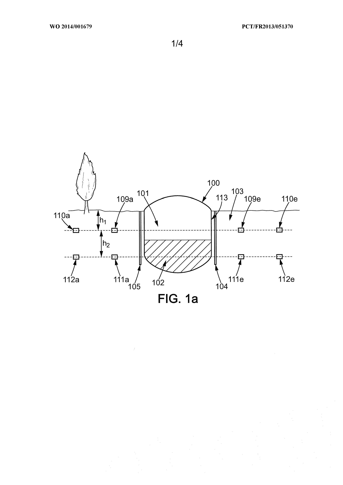
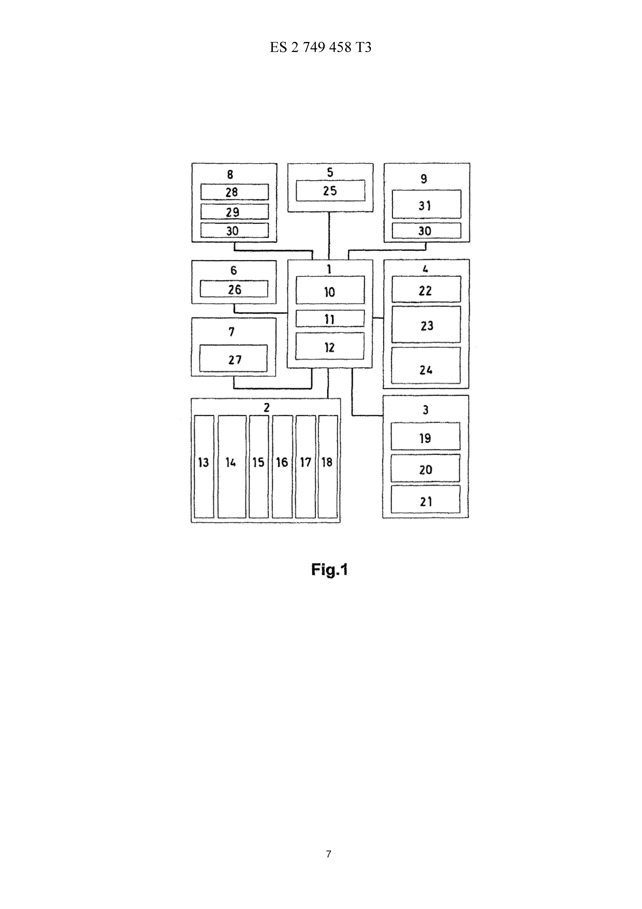

# Patentes

## 1. WO2014001679A2  
### Método y dispositivo para el monitoreo de parámetros de almacenamiento

- **Número de publicación:** WO2014001679A2  
- **CIP:**  
  - E02D1/08  
  - E02D27/35  
  - G01K1/00  
  - G01N7/00  
  - G06F15/82  
  - F17C13/02  
  - F17C13/08  
  - F17C3/00
 
- **IMAGEN:**
 

### Resumen  
La invención se refiere a un método para monitorizar una estructura de almacenamiento excavada en tierra congelada. El método comprende:  
- Recepción de una referencia de temperatura asociada a un sensor.  
- Recepción de la temperatura medida por el sensor.  
- Determinación del factor de fracturación del suelo en función de la temperatura medida y la referencia.  
- Activación de una alerta si el factor supera un umbral predeterminado.  

### Enlace  
https://worldwide.espacenet.com/patent/search/family/047022786/publication/WO2014001679A2?q=WO2014001679A2  

---

## 2. ES2749458T3  
### Dispositivo de control para la gestión del cultivo de plantas

- **Número de publicación:** ES2749458T3  
- **CIP:**  
  - A01B79/00  
  - A01G25/16
 
- **IMAGEN:**
   

### Resumen  
El proyecto describe un dispositivo inteligente que automatiza el cuidado de las plantas mediante la medición de variables como:  
- Humedad  
- Temperatura  
- Luz  
- Nivel de abono  

Características principales:  
- Módulos interconectados que analizan datos.  
- Capacidad de aprendizaje basada en usos previos.  
- Ejecución automática de acciones como riego e iluminación.  
- Comunicación con otros dispositivos y con el usuario.  
- Instalación parcialmente enterrada con sensores en suelo y aire.  

Su objetivo es optimizar el mantenimiento y crecimiento de los cultivos de manera automática.  

### Enlace  
https://worldwide.espacenet.com/patent/search/family/046179249/publication/ES2749458T3?q=ES2749458T3  

---

## 3. CN101936935A  
### Dispositivo para medir múltiples parámetros del suelo

- **Número de publicación:** CN101936935A  
- **CIP:**  
  - G01K7/00  
  - G01N27/02  
  - H02J7/00
 
- **IMAGEN:**
   

### Resumen  
El proyecto presenta un dispositivo para medir múltiples parámetros del suelo mediante una varilla hueca que integra sensores a diferentes profundidades.  

Mide:  
- Humedad  
- Conductividad  
- Temperatura  

Funcionamiento:  
- Los sensores recopilan datos continuamente.  
- Los datos se envían a un módulo de adquisición.  
- Se calcula el potencial mátrico del suelo.  

Esto permite un monitoreo continuo y preciso, mejorando la toma de decisiones en la producción agrícola.  

### Enlace  
https://worldwide.espacenet.com/patent/search/family/043390376/publication/CN101936935A?q=CN101936935A  
