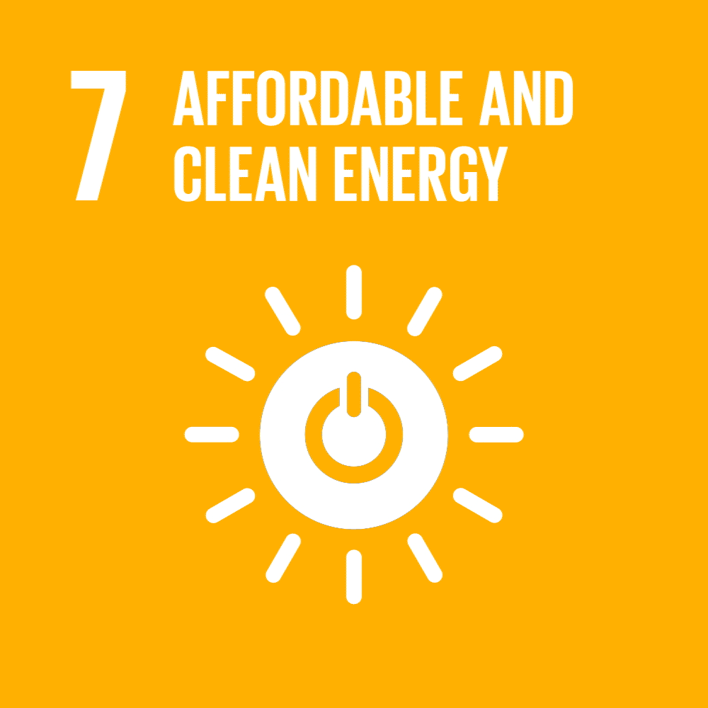
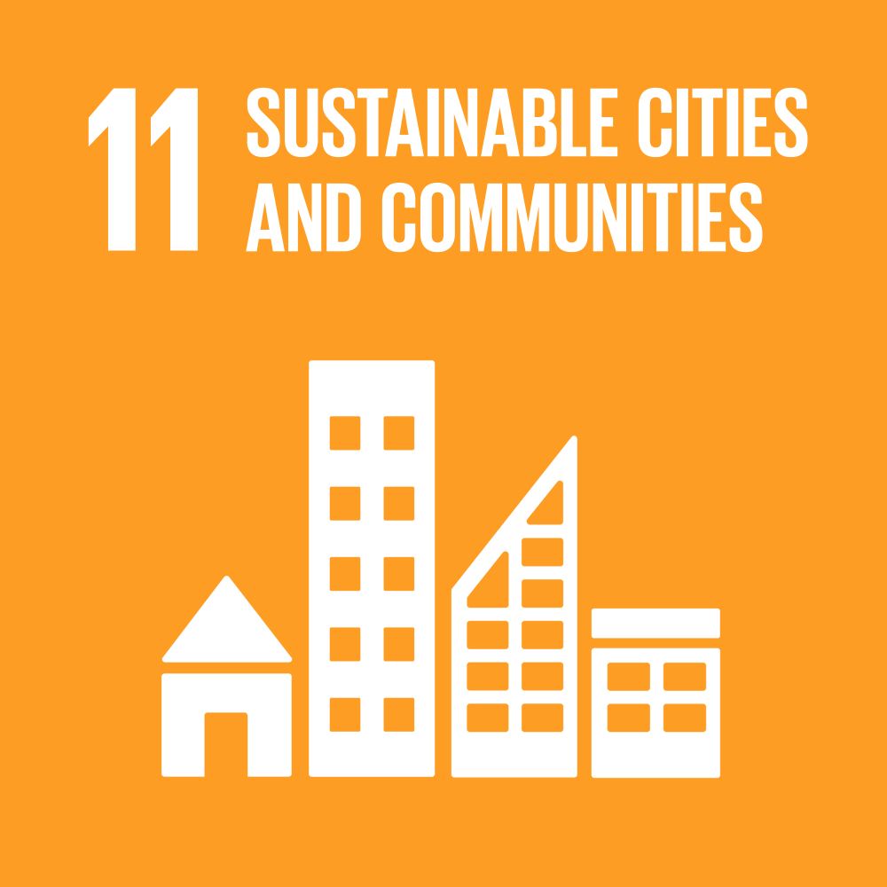

# Equipo 06 - Fundamentos de diseño
### Carrera de Ingeniería Ambiental / Informática / Industrial  
**Universidad Peruana Cayetano Heredia**

---

## 🌍 Descripción del Equipo  
Somos el **Equipo 06** del curso **Fundamentos de Diseño 2026-1**, conformado por estudiantes de la carrera de Ingeniería Ambiental / Informática / Industrial.  
Nuestro objetivo es aplicar la metodología de diseño para generar soluciones innovadoras con impacto social, tecnológico y ambiental.  

Nos interesa trabajar en los siguientes **Objetivos de Desarrollo Sostenible (ODS):**  
- ODS 7: Energía asequible y no contaminante
   
- ODS 11: Ciudades y Comunidades Sostenibles
   

---

## 📸 Fotografía del Equipo  

  <em>Figura 1. Fotografía del equipo 06</em>

---

## 👥 Integrantes del Equipo  

| Foto | Nombre | Rol | Intereses
|------|--------|-----|-----------|
|  | **Diego Alessandre Murga Saavedra  diego.murga@upch.pe** | Líder del equipo/Electrónico | Innovación social, sostenibilidad, electrónica |
|  | **Jeral Cueva** | Programador/Modelador | Programación y Simulación |
|  | **Jose Ccencho** | Investigación | Redacción técnica |
|  | **Kiara Aragon** | Responsable de investigación | Gestión ambiental, desarrollo comunitario |
|  | **Ithan De la Cruz** | Diseñador | Diseño de prototipos, creatividad aplicada |

---

## 📌 Resumen Final  
Este README resume quiénes somos, qué nos motiva y en qué ODS queremos enfocar nuestro trabajo durante el curso.  
